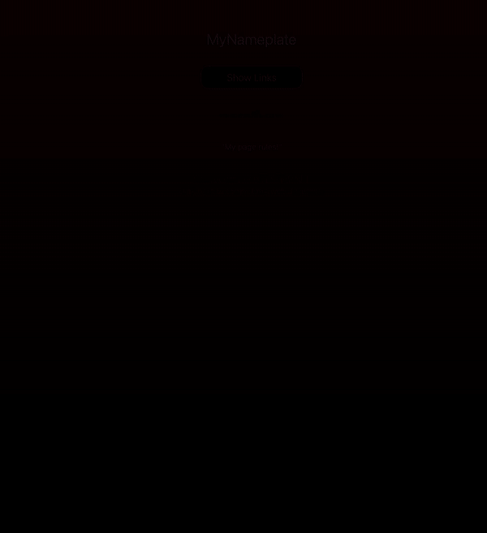

 <h1 id="project-title">BiteSites</h1>
 <h3 style="font-style:italic">Centralize what matters most.</h3>
 <h3>Exclusive copyright Tres Leches collective</h3>

 [Read more about the omission of a license for this repository](https://choosealicense.com/no-permission/)

<h2 id="table-contents">Table of Contents</h2>

-[Description](#project-desc)

-[See It Deployed!](#project-live)

-[Screen Captures](#project-captures)

-[Technology](#project-tech)

-[Usage](#project-usage)

-[Questions/Contact](#project-contact)

<!-- -[References](#project-ref) -->

<h2 id="project-desc">Description</h2>

BiteSites is a website service that allows creators to build one page landing pages to consolidate their social media presence.

<a href="#project-title">Back to Top</a>

<h2 id="project-live">See it deployed live!</h2>

[See application live here!](https://bitesites.herokuapp.com/)

<h2 id="project-captures">Screen captures</h2>

| Image | Description |
| --- | ----------- |
|   | Application selection use |
|   | Application form entry in use |
|   | Application output |

<a href="#project-title">Back to Top</a>

<h2 id="project-tech">Technology</h2>

At its core, BiteSites is a standard React project which utilizes a Model-View-Controller paradigm. It achieves this using the following technologies:

- MongoDB
- GraphQL
- React.js
- Node.js
- Formik
- JWT

<a href="#project-title">Back to Top</a>

<h2 id="project-usage">Usage</h2>

Usage is limited at this time to members of the Tres Leches organization. 

<a href="#project-title">Back to Top</a>

<h2 id="project-ref">References/Resources</h2> 

- [Formik](https://formik.org/docs/overview)

<a href="#project-title">Back to Top</a>

<h2 id="project-contact">Questions / Contact</h2>

- [See Michael's other work on GitHub](https://github.com/mcjbyday) 
- [See Nick's other work on GitHub](https://github.com/NBFxSuccess) 
- [See Alec's other work on GitHub](https://github.com/AlecDziwanowski) 

<a href="#project-title">Back to Top</a>

